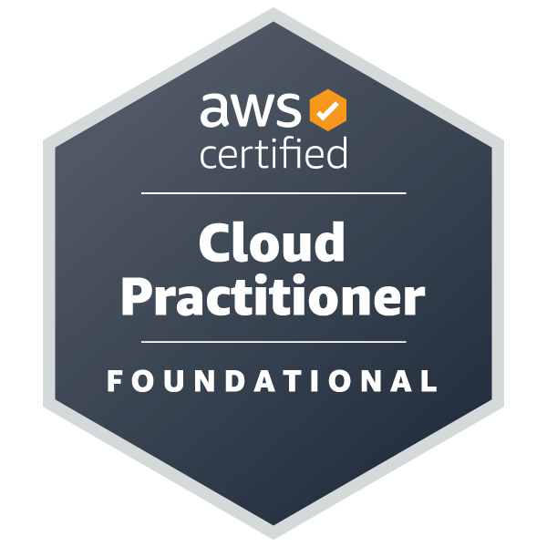

  
  

<h1 align="center">👋 Salut, moi c'est <strong>Oswaaaald</strong> !</h1>

  🎓 Étudiant à <strong>19 Brussels (42 Network)</strong> 
  ☁️ <strong>Certifié AWS</strong> (Cloud Practitioner & Solutions Architect Associates)

	

<h2>🚀 Projets en cours</h2>

  🛠️ <a href="https://github.com/Xyxy21/webserv" target="_blank"><strong>Webserv</strong></a> 

<h2>📊 GitHub Stats</h2>

	
	

<h2>🎓 Certifications</h2> 

	
	

<h2>🛠️ Compétences</h2> 

	 
	

<h2>📖 Learning</h2> 

	

<h2>🌍 Me contacter</h2>

	

---

<i>✨ Fait avec passion par Oswaaaald</i>

